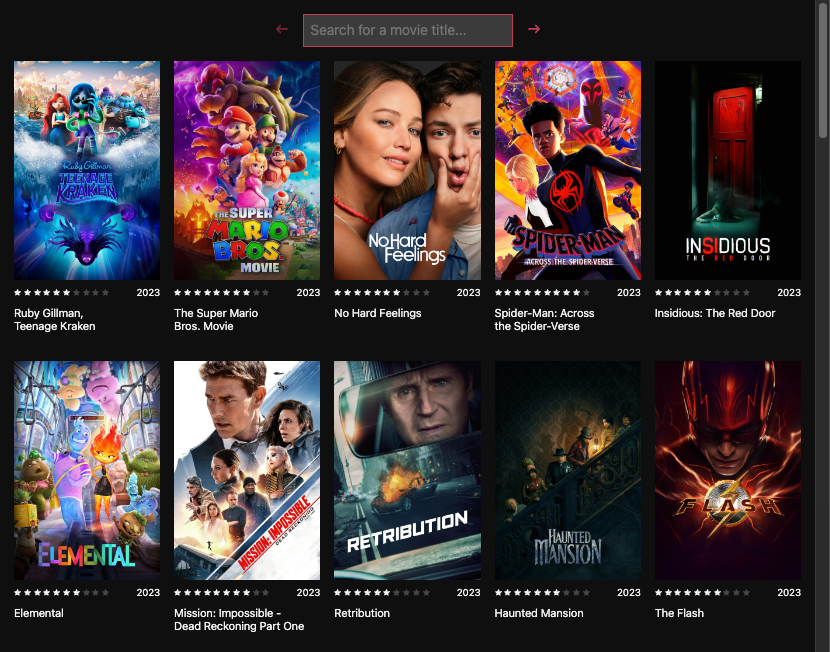

# 🍿 Movie Server

Watch movies in your browser.



### Getting Started

```shell
cp app/.env.example app/.env
npm install
npm start # http://localhost:3000
```

### Notes

Movies will update every minute (unless the cron job is already running). The cron job for updating movies
is run from code inside the `cms` directory.
